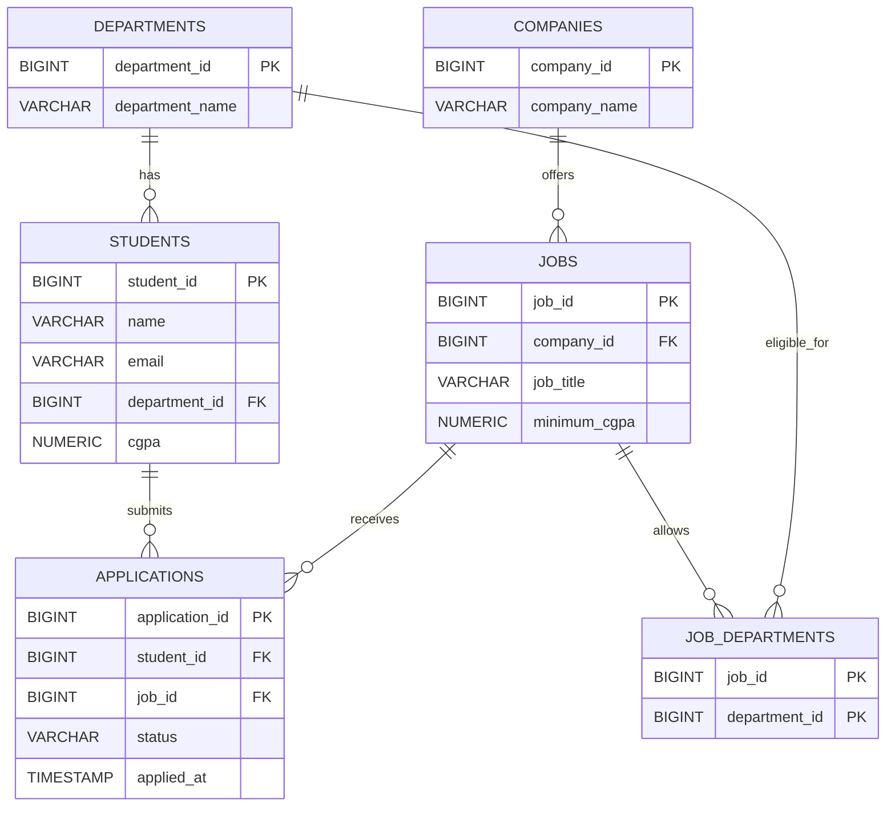

# Level 2 - College Placement Management Portal

## Entity Relationship Diagram

```mermaid
erDiagram
    DEPARTMENTS ||--o{ STUDENTS : has
    COMPANIES ||--o{ JOBS : offers
    JOBS ||--o{ JOB_DEPARTMENTS : allows
    DEPARTMENTS ||--o{ JOB_DEPARTMENTS : eligible_for
    STUDENTS ||--o{ APPLICATIONS : submits
    JOBS ||--o{ APPLICATIONS : receives

    DEPARTMENTS {
        BIGINT department_id PK
        VARCHAR department_name
    }

    STUDENTS {
        BIGINT student_id PK
        VARCHAR name
        VARCHAR email
        BIGINT department_id FK
        NUMERIC cgpa
    }

    COMPANIES {
        BIGINT company_id PK
        VARCHAR company_name
    }

    JOBS {
        BIGINT job_id PK
        BIGINT company_id FK
        VARCHAR job_title
        NUMERIC minimum_cgpa
    }

    JOB_DEPARTMENTS {
        BIGINT job_id PK
        BIGINT department_id PK
    }

    APPLICATIONS {
        BIGINT application_id PK
        BIGINT student_id FK
        BIGINT job_id FK
        VARCHAR status
        TIMESTAMP applied_at
    }
```
